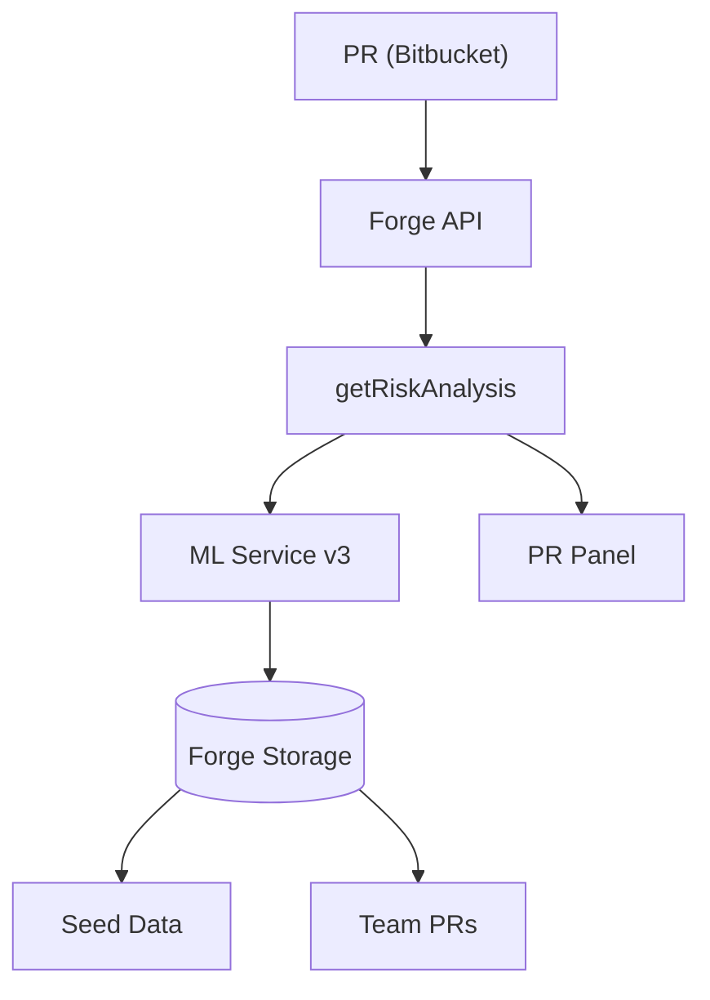
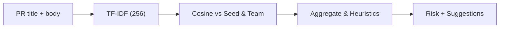
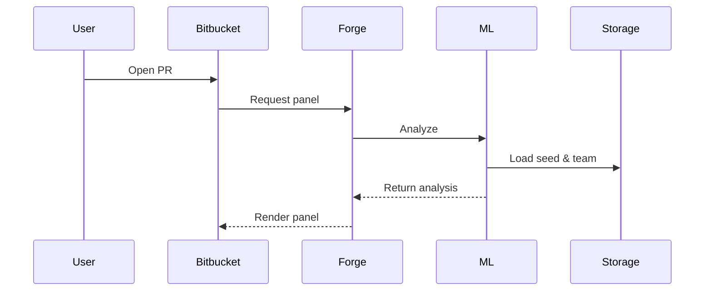
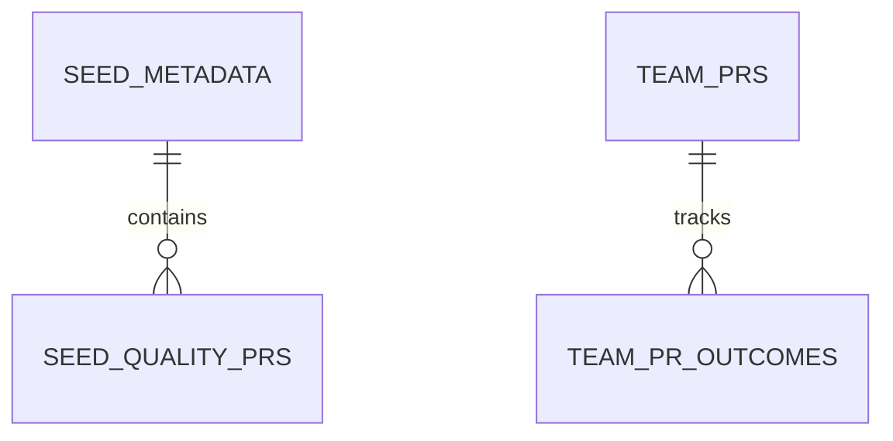

# 🎯 PitStop AI — PR Risk Analysis

PitStop AI analyzes Bitbucket pull requests and returns an explainable risk score,
improvement suggestions, and similar historical PR examples. All processing runs
inside Atlassian Forge (no external network egress).

---

## Quick start

1. Clone and build

```bash
git clone https://github.com/Shafwansafi06/CodeRiskRadar.git
cd CodeRiskRadar
npm install
cd frontend && npm install && npm run build && cd ..
```

2. Deploy to Forge

```bash
forge login
forge deploy
forge install --site your-workspace.atlassian.net
forge eligibility   # verify Runs on Atlassian
```

Open any PR in Bitbucket and check the "Code Risk Analysis" panel.

---

## Summary

- Hybrid ML: TF-IDF (256-dim) vectors + cosine similarity against curated seed PRs
  and recent team PRs (max 500).
- Privacy-first: seed + team data live in Forge Storage; manifest.yml does not use
  external.fetch so the app can be eligible for "Runs on Atlassian".
- Outputs: risk score (0–100), factor breakdown, improvement suggestions,
  and similar PR examples.

---

## Architecture (compact diagrams)

### 1) System overview



### 2) ML pipeline



### 3) Data flow (sequence)



### 4) Storage (simplified ER)



---

## Key files

- `frontend/src/App.jsx` — UI panel; reads PR metrics from `data.stats` (additions,
  deletions, changedFiles) and renders the risk panel.
- `frontend/src/styles.css` — responsive styling tuned for Bitbucket panels.
- `src/services/mlService_v3.js` — TF-IDF generator, cosine similarity, hybrid scoring,
  and suggestion generation.
- `manifest.yml` — Forge app config and scopes (no external.fetch for Runs-on-Atlassian).

---

## Troubleshooting & notes

- If the UI looks off in Bitbucket at 100% zoom: open a PR, capture a screenshot,
  and I'll iterate the CSS. The `App.jsx` SVG ring and `styles.css` were tuned for
  narrow panels.
- If seed data is missing, redeploy and check `forge logs` for seed-load messages.
- Security: rotate any exposed keys outside this repo and place secrets in the
  environment or Forge secrets according to SECURITY.md.

---

If you'd like, I can commit & push this README and the UI fixes to `main` for you —
reply "please push" and I'll do it.

---

MIT © 2025 — PitStop AI / Shafwan Safi
