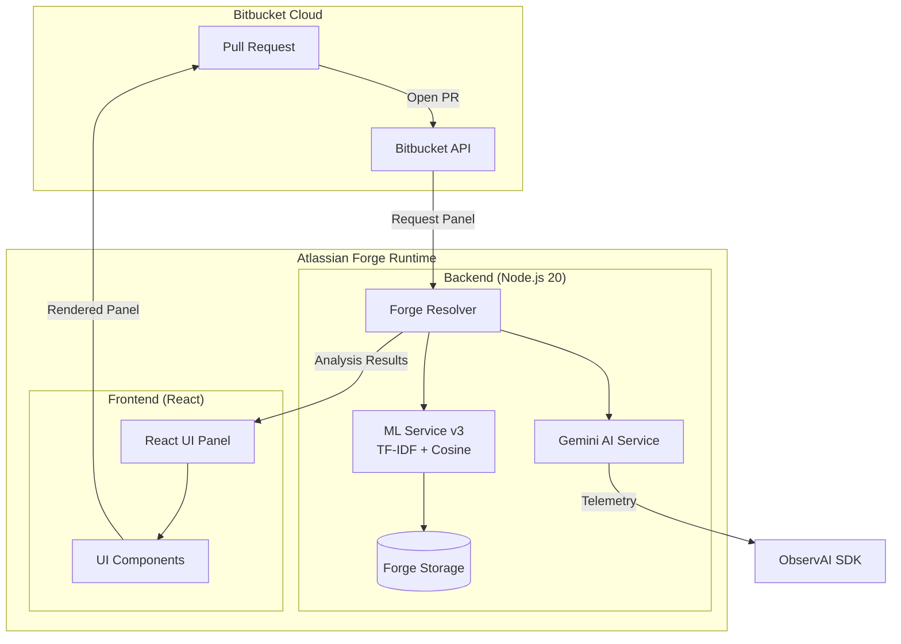
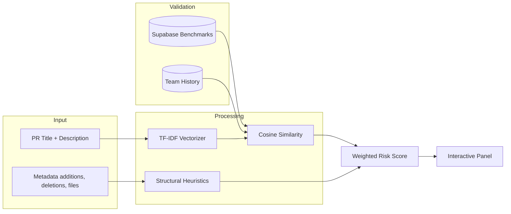
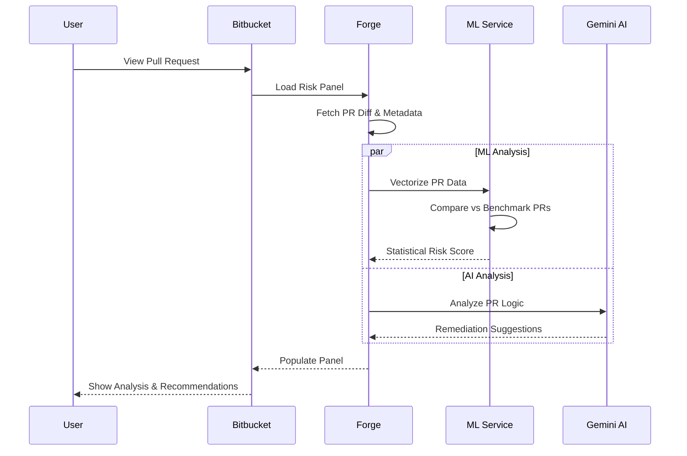

# 🎯 PitStop AI — PR Risk Analysis System

[](https://developer.atlassian.com/platform/forge/)
[](https://deepmind.google/technologies/gemini/)
[](#security--privacy)

PitStop AI is a high-performance, privacy-first risk analysis system for Bitbucket Pull Requests. It leverages **Gemini 2.0** and custom **ML heuristics** to provide explainable risk scores, actionable suggestions, and historical context—all without your code ever leaving the Atlassian Forge environment.

---

## ✨ Key Features

- **🚀 Dual-Engine Analysis**: Combines Gemini AI logic with a TF-IDF + Cosine Similarity ML engine.
- **🛡️ Structural Protection**: Automatically flags breaking changes in critical files (Auth, API, Config).
- **📉 Documentation Discount**: Intelligent enough to recognize low-risk documentation-only changes.
- **🔄 Stale-Free Recommendations**: Content-aware caching ensures you always see suggestions for your *latest* code version.
- **🏠 Secure by Design**: Runs entirely on **Runs on Atlassian** (No external network egress required).

---

## 🏗️ System Architecture

PitStop AI operates as an integrated Forge application within the Bitbucket ecosystem.



---

## 🔬 How it Works: The ML Pipeline

We don't just guess risk; we calculate it using a multi-dimensional approach.



---

## 🌊 Logic Flow

When you open a PR, PitStop AI springs into action:



---

## 🚀 Getting Started

### 1. Prerequisites
- [Forge CLI](https://developer.atlassian.com/platform/forge/getting-started/) installed.
- [Bitbucket Cloud](https://bitbucket.org/) workspace.
- [Supabase](https://supabase.com/) project (for benchmarking data).

### 2. Installation

1. **Clone the Repo**
   ```bash
   git clone https://github.com/Shafwansafi06/CodeRiskRadar.git
   cd CodeRiskRadar
   ```

2. **Setup Frontend**
   ```bash
   cd frontend
   npm install && npm run build
   cd ..
   ```

3. **Deploy to Forge**
   ```bash
   forge deploy
   forge install      # Select your Bitbucket site
   ```

4. **Variables Configuration**
   ```bash
   forge variables set SUPABASE_URL your_url
   forge variables set SUPABASE_SERVICE_KEY your_key
   forge variables set GEMINI_API_KEY your_key
   ```

---

## 🔐 Security & Privacy

PitStop AI is designed for enterprise-grade security:
- **No Code Leakage**: Your code diffs are processed in the volatile memory of the Forge runtime.
- **Atlassian Egress**: All outgoing connections are explicitly declared in the `manifest.yml`.
- **Telemetry**: Uses the [ObservAI SDK](https://observai.ai) for secure LLM monitoring without content logging.

---

## 🤝 Contributing

We welcome contributions! Please see our [Contributing Guide](CONTRIBUTING.md) for details.

---

MIT © 2025 — **PitStop AI** | Created by **Shafwan Safi** 🚀
